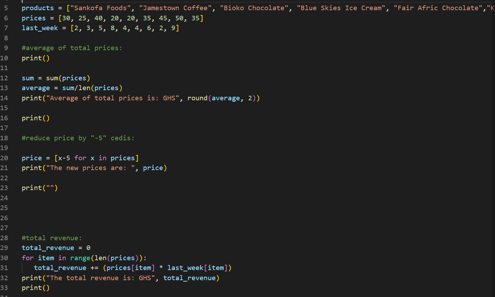
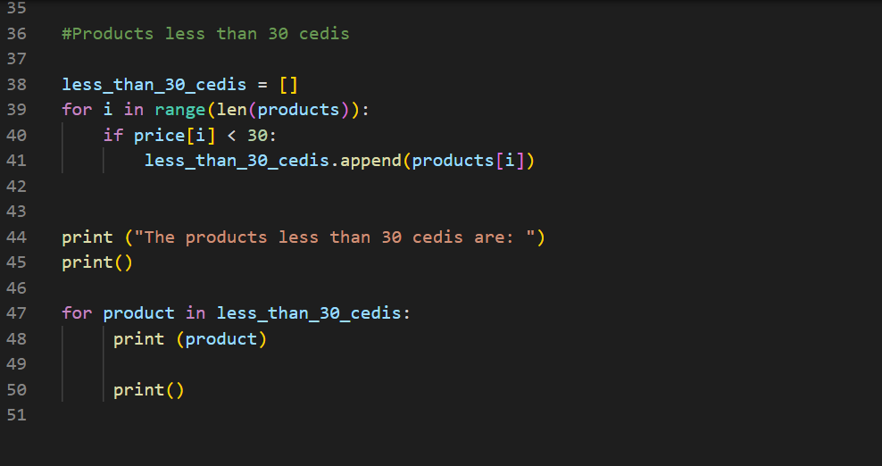
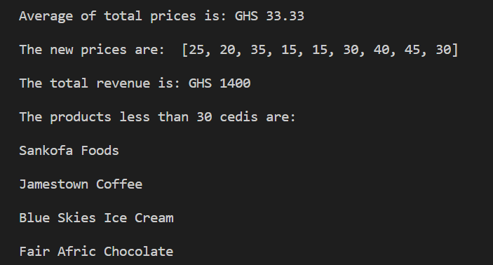

# 	🐍Python-dictionary📖

## Description
This project is aimed at finding average of the 'total prices'💰 of the products, find a '5 cedis'💰 reduction in all prices, generate the 'total revenue'💰 of the original prices and identify products with 'price below 30 cedis'💰.

## Screenshots📷 of codes:

&nbsp;

## Screenshot📷 of the result of the python codes:

 ## Note:
 This code does not print the dictionary dataset. If you wish to print them out, you can run the following codes in cell 5 to 7:

 print(products)
 print(prices)
 print(last_week)

 :bulb:'last_week' is the number of purchases made the previous week.

## Author👨 
Edison Denutsui